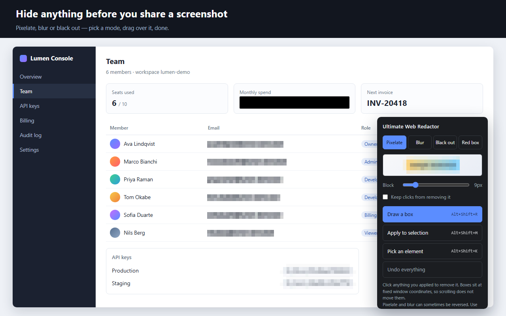

# Ultimate Web Redactor

ページの一部をモザイク・ぼかし・黒塗りで隠したり、赤枠で囲んで目立たせたりする Chrome 拡張。
スクリーンショットを撮る前の目隠しと、見せたい箇所の強調を、ページ上で直接やる。

manifest v3。ライブラリ依存なし。ホスト権限を持たず、右クリック・ショートカット・ツールバーから
呼ばれたときだけ `activeTab` でその場に注入される。通信も解析もアカウントもない。



## 使い方

インストールは開発者モードで読み込む。

1. `chrome://extensions` を開く
2. 右上の「デベロッパーモード」をオン
3. 「パッケージ化されていない拡張機能を読み込む」でこのフォルダを選ぶ

範囲の指定は3通り。

- **矩形** (`Alt+Shift+R` / ポップアップ) ドラッグで囲んだところに適用する。ウィンドウ基準の固定座標なので、
  スクロールしても位置は動かない。Esc を押すまで続けて何個でも引ける
- **選択範囲** テキストを選んで右クリック、または `Alt+Shift+M`（隠す）/ `Alt+Shift+F`（赤枠）
- **要素** 画像や表の1行など、選択できないものは `Alt+Shift+K` の要素ピッカーで指定する。
  カーソルの下がハイライトされ、`↑` で親、`↓` で子、クリックで適用、`Esc` で中止。
  画像と動画は右クリックからも直接指定できる

**加工した部分はクリックすると消える。** 一時的に戻すのではなく完全に解除する。
ページ全体はポップアップの「すべて解除」か右クリックメニューから戻す。
消えると困る場合は「クリックで消せないようにする」を入れる。

## モード

| モード | 中身 | 調整 |
|---|---|---|
| モザイク | SVG フィルタでブロック単位に潰す | ブロックの一辺 3–40px |
| ぼかし | `filter: blur()` | 半径 1–40px |
| 黒塗り | 塗り潰し。復元の余地がない | なし |
| 赤枠 | `outline`。レイアウトを動かさない | 太さ 1–12px / 余白 0–24px / 角丸 0–32px / 色5種 |

ポップアップとショートカット `Alt+Shift+R` / `Alt+Shift+K` は、いま選んでいるモードで適用する。
右クリックの「隠す」と `Alt+Shift+M` は赤枠を選んでいても隠す側になり、最後に選んだ
モザイク・ぼかし・黒塗りのどれかを使う。

モザイクとぼかしは、元の文字が推測できることがある。確実に消したいなら黒塗りを使う。

## 仕組みのメモ

選択範囲は、境界にかかるテキストノードを分割してから、範囲に完全に含まれる最も外側のノードだけを
拾って加工する。テキストノードは `<span>` で包み、要素はそのまま使う。解除時は包んだ span を外して
`normalize()` するので DOM は元に戻る。

矩形は `position: fixed` の div をページに置き、下の内容を `backdrop-filter` で潰す。
Chrome は `backdrop-filter: url(#svgフィルタ)` を受け付けるので、モザイクもここで効く。

モザイクの SVG フィルタでハマる点が2つある。

- `filterUnits` を既定の `objectBoundingBox` にすると、インライン要素には bounding box が無いので
  Chrome ではフィルタ領域が潰れて要素ごと消える。`userSpaceOnUse` にする必要がある。
- その `userSpaceOnUse` の原点は、インライン要素自身ではなく **それを含むブロック要素の左上**。
  段落の左端から遠い要素ほど領域からはみ出すので、ブロック内でのオフセットぶんも含めて領域を張る。
  ブロック要素や固定配置の矩形なら原点は自分の左上なので、サイズぶんだけで足りる。

領域はサイズを 64/128/256... に丸めて使い回す。窓幅が変わると折り返しが変わるので、リサイズ後に
張り直す。

`<base href>` のあるページでは `filter: url(#id)` が外部参照扱いになって効かないため、
モザイクを選んでいてもぼかしに落とす。

## 開発

```bash
node test/server.js
```

`http://localhost:5599/test/harness.html` がテスト用ページ。content.js をそのまま読み込んでいて、
`window.__ultimateWebRedactor` から直接叩ける。ポップアップの見た目は `http://localhost:5599/src/popup.html`
で確認できる（拡張の外でも開くようにしてある）。

アイコンは `test/make-icons.ps1` で生成する。16x16 のドット絵を1枚だけ定義して、48/128 は
整数倍でそのまま拡大しているので、どのサイズでも潰れない。

ストア提出用の zip は `build.ps1`。宣材のスクリーンショットは、サーバを立てた状態で
`promo/shoot.ps1` を叩くとヘッドレス Chrome が 1280x800 で撮る。

## ライセンス

MIT
